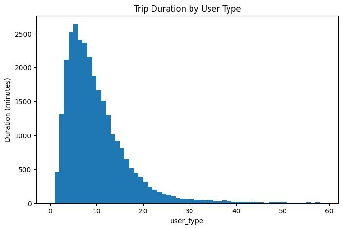
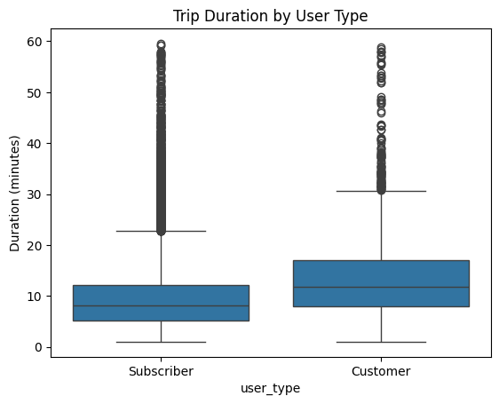
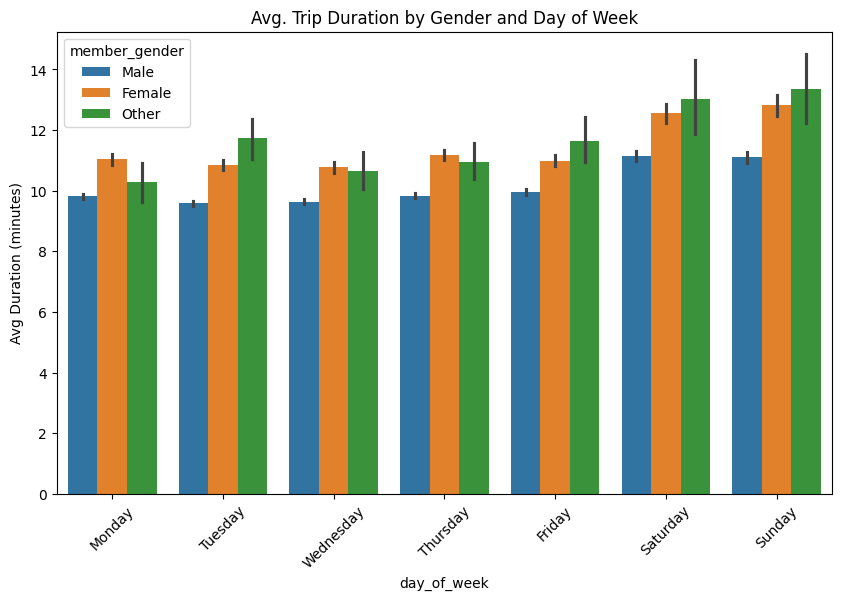
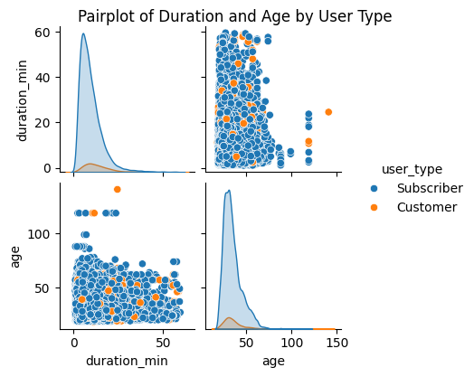
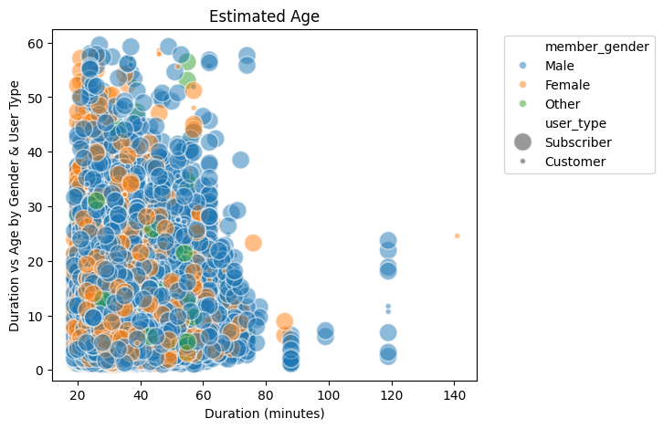

# 🚲 Ford GoBike System Data Analysis

## Project Overview

This project explores the Ford GoBike bike-sharing dataset for February 2019 in the San Francisco Bay Area. The analysis aims to uncover usage patterns and insights into how trip durations vary by user type, gender, age, and day of the week.

The final notebook is structured into data wrangling, univariate, bivariate, and multivariate exploration, and concludes with key insights and visual storytelling.

---

## Dataset Information

- **Source**: [Udacity Nanodegree Dataset]
- **Rows**: ~29,000 entries (cleaned)
- **Columns**: 16 features including timestamps, user demographics, and station metadata.
- **Main feature of interest**: `trip duration`

---

## Data Wrangling Summary

- Removed null values.
- Converted `duration_sec` to `duration_min` for interpretability.
- Parsed datetime fields and derived weekday names.
- Filtered out trips longer than 60 minutes as outliers.

---

## Exploratory Data Analysis

### ➤ Univariate Exploration:
- Distribution of trip durations.
- Count plots for gender and user type.
- Bar charts of user group proportions.

### ➤ Bivariate Exploration:
- Box plots of duration by user type.
- Scatterplots of age vs. duration.
- Grouped bar charts by gender and user type.

### ➤ Multivariate Exploration:
- Visualizations involving `user_type`, `gender`, `age`, and `day_of_week`.
- Complex interactions shown through pair plots and multi-encoding scatterplots.

---

## Top Visualizations

Here are the most important visualizations created during the analysis and what they reveal:

---

#### 1. Histogram of Trip Durations

- Most trips last between **5–15 minutes**.
- Long outliers beyond 60 minutes were removed.

---

#### 2. Boxplot of Trip Duration by User Type

- **Subscribers** take shorter, consistent trips.
- **Customers** show greater variation and longer average duration.

---

#### 3. Average Trip Duration by Gender and Day of Week

- Duration is higher on **weekends** for all genders.
- "Other" gender group shows the **longest durations**.

---

#### 4. Pairplot: Duration and Age by User Type

- Distribution shows that **younger subscribers** are more frequent riders.
- Customers span a broader age range with longer trips.

---

#### 5. Multivariate Scatterplot

- Encodes four variables in one:
  - `x`: Age
  - `y`: Trip Duration
  - `Hue`: Gender
  - `Size`: User Type

---

## Key Findings

- Most trips are short, under 20 minutes.
- Subscribers take shorter trips, likely commuters.
- Customers take longer trips, possibly tourists.
- Weekend trips are longer than weekday trips.
- The “Other” gender group tends to have the longest average durations.

---

## Tools Used

- Python
- Pandas
- NumPy
- Matplotlib
- Seaborn
- Jupyter Notebook

